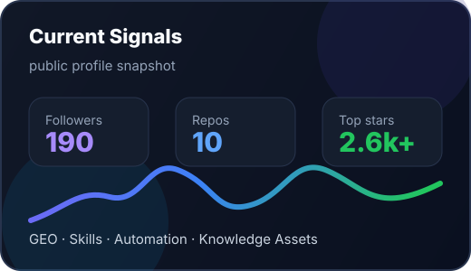
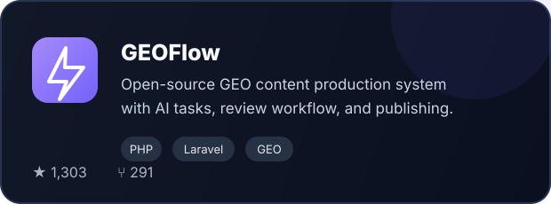
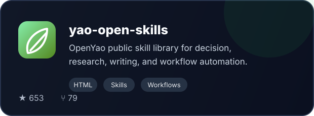
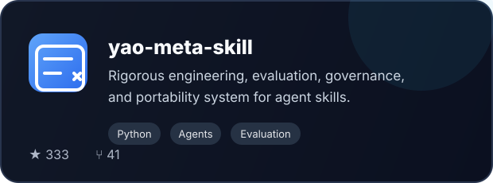
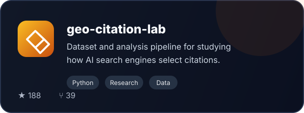
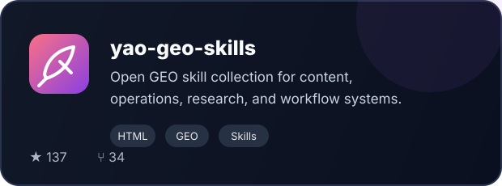

  

   

  
  
  
  

 

<table>
  <tr>
    <td width="62%" valign="top">
      <h3>把 AI 方法论沉淀成可复用的工作流资产</h3>
      

        我长期关注 AI 营销、GEO（生成式引擎优化）、AI 教育、Agent Skills 与自动化工作流。
        这里主要放开源项目、可复用技能、研究型数据集和公开方法论。
      

      

        <strong>当前主线：</strong>GEO 内容生产系统、AI Skill 工程化、AI 搜索信源研究、知识资产自动化。
      

      

        <strong>长期更新：</strong>
        <a href="https://jiahejiaoyu.feishu.cn/docx/YHOHd1TLyom6KDxQY8Ac8m4hngf">《姚金刚认知随笔》</a> ·
        <a href="https://yaojingang.github.io">个人博客</a> ·
        <a href="https://github.com/yaojingang/yaojingang.github.io/discussions/1">留言入口</a>
      

    </td>
    <td width="38%" valign="top">
      
    </td>
  </tr>
</table>

## Featured Projects

<table>
  <tr>
    <td width="50%">
      
    </td>
    <td width="50%">
      
    </td>
  </tr>
  <tr>
    <td width="50%">
      
    </td>
    <td width="50%">
      
    </td>
  </tr>
</table>

  

## Tech & Focus

  
  
  
  
  

## Contact

- 微信：`laoyaoke`
- X：[@yaojingang](https://x.com/yaojingang)
- 博客：[yaojingang.github.io](https://yaojingang.github.io)
- 留言：[GitHub Discussion](https://github.com/yaojingang/yaojingang.github.io/discussions/1)
